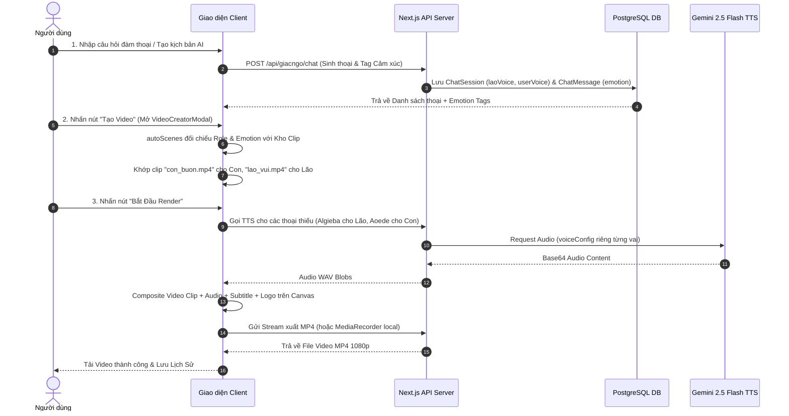

# 🛠 KĨ THUẬT XỬ LÝ LUỒNG ĐÀM THOẠI, TẠO KỊCH BẢN & DỰNG VIDEO PHÁP BẢO (TECHNICAL PIPELINE SPECIFICATION)

Tài liệu mô tả chi tiết toàn bộ kiến trúc kĩ thuật, quy trình xử lý dữ liệu và luồng âm thanh/hình ảnh khi hệ thống **Ông Lão** thực hiện:
1. **Luồng Đàm thoại trực tiếp (Live Conversation Step)**
2. **Luồng Đạo diễn & Sáng tạo Kịch bản AI (AI Director Script Pipeline)**
3. **Luồng Dựng & Render Video Pháp Bảo Toàn Cảnh (FullFrame Video Creator Pipeline)**

---

## 📌 1. KIẾN TRÚC TỔNG QUAN (TECHNICAL ARCHITECTURE)

Một lượt đàm thoại & dựng video tiêu chuẩn gồm **3 thành phần âm thanh & văn bản** kết hợp nối tiếp nhau:

```text
┌────────────────────────┐      ┌────────────────────────┐      ┌────────────────────────┐
│  1. MÀO ĐẦU (GREETING) │  ──► │   2. KỆ PHÁP (STANZA)  │  ──► │  3. GIẢI ĐÁP (TTS AI)  │
│  Text + Pre-rendered   │      │  Text + Pre-rendered   │      │  Text AI + Gemini TTS  │
│  MP3 Audio (Có sẵn)    │      │  MP3 Audio (Có sẵn)    │      │  WAV Audio (Sinh ngầm) │
└────────────────────────┘      └────────────────────────┘      └────────────────────────┘
```

---

## ⚙️ 2. QUY TRÌNH THỰC THI CHI TIẾT 4 BƯỚC ĐÀM THOẠI

### BƯỚC 1: XỬ LÝ CÂU MÀO ĐẦU (OPENING PHRASE / GREETING)
1. **Phân loại Ngữ cảnh (Category Mapping)**:
   - Khi người dùng gửi tin nhắn, hệ thống NLP phân tích từ khóa để chọn nhóm mào đầu phù hợp:
     - `mundane_weather` (Thời tiết / Chuyện đời thường)
     - `serious_dharma` (Hỏi đạo nghiêm túc)
     - `love_heartbreak` (Tình cảm / Tổn thương)
     - `money_debt` (Tài chính / Nợ nần / Công danh)
2. **Trích xuất Dữ liệu Mào đầu**:
   - Truy vấn câu mào đầu từ DB PostgreSQL (`OpeningPhrase`):
     - `text`: Văn bản mào đầu (VD: *"A Di Đà Phật, lão chào con..."*).
     - `audioUrl`: Đường dẫn tệp âm thanh thu sẵn (VD: `/uploads/audio/greeting_mundane_weather_0.wav`).
3. **Phát Âm Thanh Mào Đầu**:
   - Hệ thống lập tức phát `audioUrl` mào đầu mà **KHÔNG CẦN CHỜ AI** sinh câu trả lời, giúp người dùng nghe giọng Lão ngay lập tức (độ trễ 0s).

---

### BƯỚC 2: TRÍCH XUẤT KỆ PHÁP / THƠ THIỀN (POEM STANZA & AUDIO)
1. **Truy vấn Kệ Pháp (RAG Knowledge Matching)**:
   - Tìm kiếm bài kệ pháp/khổ thơ liên quan nhất đến trăn trở của người dùng trong DB (`Poem` & `Stanza`).
2. **Trích xuất Dữ liệu Kệ**:
   - `text`: Nội dung khổ kệ thiền.
   - `audioUrl`: Đường dẫn âm thanh ngắt nhịp thơ thu sẵn (`stanza.audioUrl`).
3. **Nối Chuỗi Âm Thanh (Audio Queueing)**:
   - Thêm `stanza.audioUrl` vào danh sách chờ phát nối tiếp sau câu mào đầu.

---

### BƯỚC 3: AI GIẢI ĐÁP & SINH GIỌNG ĐỌC TTS (GEMINI AI & TTS SYNTHESIS)

Trong lúc 2 âm thanh mào đầu & kệ đang phát, hệ thống chạy **Worker ngầm (Background Prefetch)** để xử lý phần giải đáp:

1. **Sinh Văn Bản Giải Đáp (LLM Generation)**:
   - Gửi Prompt sang Gemini API kèm ngữ cảnh cuộc trò chuyện.
   - AI trả về văn bản kèm nhãn cảm xúc ở đầu dòng (VD: `[vui] An lạc vốn dĩ ở trong tâm con...`).
2. **Làm Sạch Văn Bản Cho TTS (`cleanTextForTTS`)**:
   - Loại bỏ các ký tự đặc biệt, nhãn tag `[vui]`, `[buon]`.
   - Ngắt câu bằng dấu chấm câu để TTS đọc rõ ràng.
3. **Gọi API Tổng Hợp Giọng Nói (Gemini 2.5 Flash TTS)**:
   - Gửi yêu cầu HTTP POST tới `/api/tts`:
     ```json
     {
       "text": "Giọng ấm áp, dứt khoát: An lạc vốn dĩ ở trong tâm con...",
       "voiceName": "Algieba",
       "model": "gemini-2.5-flash-preview-tts"
     }
     ```
   - Server gửi yêu cầu tới Google Gemini REST API (`generateContent` với `responseModalities: ["AUDIO"]`).
   - Server trả về dữ liệu âm thanh Base64 WAV.
4. **Tạo Blob URL**:
   - Client nhận Base64, chuyển thành `Blob` và `URL.createObjectURL(blob)` làm `audioUrl` cho phần giải đáp.

---

### BƯỚC 4: GHÉP NỐI ÂM THANH & ĐIỀU KHIỂN LIP-SYNC (AUDIO STITCHING & VISUAL DRIVER)

1. **Chuỗi Phát Nối Tiếp (Sequential Playback Queue)**:
   ```javascript
   // Luồng phát nối tiếp 3 đoạn âm thanh
   const playChain = async () => {
       await playAudio(greetingAudioUrl); // Đoạn 1: Mào đầu
       await playAudio(stanzaAudioUrl);   // Đoạn 2: Kệ pháp
       await playAudio(ttsAudioUrl);      // Đoạn 3: TTS Giải đáp
   };
   ```
2. **Đồng Bộ Nhịp Môi (Lip-Sync Driver)**:
   - Phân tích tần số âm thanh bằng `Web Audio API` (`AudioContext` & `AnalyserNode`).
   - Cập nhật biến `mouthOpen` (từ 0.0 đến 1.0) theo thời gian thực để điều khiển khẩu hình miệng của nhân vật trên canvas/CSS.
3. **Chuyển Cảnh & Cảm Xúc (State & Visual Transition)**:
   - Đổi góc máy và trạng thái cảm xúc nhân vật (`calm`, `sad`, `joy`) tương ứng với nhãn cảm xúc bóc tách từ câu thoại.

---

## 📝 5. LUỒNG KĨ THUẬT TẠO KỊCH BẢN ĐẠO DIỄN (AI DIRECTOR SCRIPT PIPELINE)

```text
┌────────────────────────────────┐       ┌────────────────────────────────┐       ┌────────────────────────────────┐
│  AI PROMPT / NHẬP THỦ CÔNG     │  ──►  │   BÓC TÁCH THOẠI & EMOTION     │  ──►  │  LƯU DB (ChatSession/Message)  │
│  Topic, Role, Emotion Arc      │       │   Con [buon], Lão [vui]        │       │  laoVoice, userVoice, emotion  │
└────────────────────────────────┘       └────────────────────────────────┘       └────────────────────────────────┘
```

### 5.1. Chế Độ 1: AI Tự Động Soạn Kịch Bản (AI Auto Generator)
1. **Tham Số Đầu Vào**:
   - `topic`: Chủ đề kịch bản (VD: *"Vượt qua áp lực công danh"*).
   - `length`: Số cặp câu thoại (VD: *"Khoảng 6-10 câu"*).
   - `laoStyle`: Phong cách giảng đạo của Lão (VD: *"Từ bi, ôn hòa, dắt dụ từng bước"*).
   - `userEmotionArc`: Mạch cảm xúc người hỏi (VD: *"Từ đau khổ/bế tắc chuyển dần sang an lạc/bừng sáng"*).
2. **Gọi AI Prompt Engineering**:
   - Gửi yêu cầu tới Gemini API kèm System Prompt quy định rõ cấu pháp output:
     ```text
     Con [buon]: Lão ơi, con thấy không vui chút nào cả.
     Lão [vui]: Cái "không vui" ấy, con thấy nó đến từ đâu?
     ```
3. **Lưu Phiên Kịch Bản Vào Database**:
   - Gọi Action `createChatSessionAction(userId, title, "script")` $\rightarrow$ Tạo bản ghi `ChatSession` với `type = "script"`.
   - Lưu cấu hình giọng riêng của phiên qua `updateChatSessionVoicesAction`:
     - `laoVoice`: `"Algieba"` | `laoVoiceStyle`: *"Giọng ấm áp, dứt khoát..."*
     - `userVoice`: `"Aoede"` | `userVoiceStyle`: *"Giọng thanh niên, thắc mắc..."*
   - Gọi `saveChatMessageAction` cho từng câu thoại kèm nhãn cảm xúc (`emotion: "buon"`, `emotion: "vui"`).

### 5.2. Chế Độ 2: Bóc Tách Kịch Bản Thủ Công (`parseToBlocks` & `handleImportScript`)
1. **Regex Phân Tách Dòng**:
   - Phân tích chuỗi văn bản đầu vào theo từng dòng thoại:
     - Dòng bắt đầu bằng `Con:`, `Hỏi:` $\rightarrow$ `role = "user"`
     - Dòng bắt đầu bằng `Lão:`, `Đáp:`, `AI:` $\rightarrow$ `role = "ai"`
2. **Khớp Mã Cảm Xúc Động Từ Database**:
   - Hàm `matchDbStateId` đối chiếu nhãn tag trong ngoặc vuông `[tag]` với API `/api/public/character-states`:
     - `[buon]` / `[sad]` $\rightarrow$ Mã ID cảm xúc `"buon"`
     - `[vui]` / `[joy]` $\rightarrow$ Mã ID cảm xúc `"vui"`
     - `[binhthuong]` / `[calm]` $\rightarrow$ Mã ID cảm xúc `"binhthuong"`
3. **Cập Nhật State & DB**:
   - Tạo danh sách `newMsgs` có cấu trúc `{ id, role, emotion, text }` và đồng bộ xuống PostgreSQL.

---

## 🎬 6. LUỒNG KĨ THUẬT DỰNG & RENDER VIDEO PHÁP BẢO (VIDEO CREATOR PIPELINE)

```text
┌────────────────────────────────┐       ┌────────────────────────────────┐       ┌────────────────────────────────┐
│  AUTO SCENES & CLIP MATCHING   │  ──►  │   SYNTHESIZE AUDIO & BGM MIX   │  ──►  │ CANVAS / FFMPEG VIDEO RENDER   │
│  Role & Emotion State Match    │       │   Algieba + Aoede + BGM 20%    │       │ 1080p MP4 (9:16 / 16:9)        │
└────────────────────────────────┘       └────────────────────────────────┘       └────────────────────────────────┘
```

### 6.1. Giai Đoạn 1: Tự Động Khớp Cảnh Quay & Video Clip (`autoScenes`)
1. **Tạo Danh Sách Cảnh (`ffScenes`) Từ Kịch Bản**:
   - Mỗi câu thoại `ChatMessage` được chuyển đổi thành 1 Thẻ Cảnh Quay (`Scene Card`):
     - `targetRole`: `"lao"` (nếu role thoại là `ai`/`ASSISTANT`), `"user"` (nếu role thoại là `user`), hoặc `"outro"`.
     - `finalEmotion`: Mã cảm xúc bóc tách từ thoại (`buon`, `vui`, `binhthuong`).
2. **Thuật Toán Khớp Clip Tự Động (Bilingual Role & Emotion Matcher)**:
   - Hệ thống lọc qua kho clip trong `FULLFRAME_PACKS` và `localFfClips`:
     - **Bước 1**: Tìm clip trùng khớp cả Vai lẫn Cảm xúc (`isRoleMatch(c.role, targetRole) && isEmoMatch(c.emotion, finalEmotion)`).
     - **Bước 2**: Tìm clip trùng khớp Vai (`isRoleMatch(c.role, targetRole)`).
     - **Bước 3**: Tìm clip theo từ khóa tên file (tên có chứa `lao`/`ai` cho Lão; chứa `con`/`user` cho Con).
     - **Bước 4**: Fallback nạp theo thứ tự mảng cùng vai.
3. **Kiểm Tra & Loại Bỏ Xung Đột Góc Máy (Role Conflict Safeguard)**:
   - Nếu cảnh mang vai `"user"` (Máy quay Con) nhưng clip mang tên chứa `lao` $\rightarrow$ Tự động xóa bỏ URL lệch góc máy, trả về khung chờ clip chuẩn cho Con.

### 6.2. Giai Đoạn 2: Tổng Hợp Âm Thanh & Nhạc Nền (Multi-Speaker TTS & BGM Mixing)
1. **Kiểm Tra & Tạo Âm Thanh Thiếu**:
   - Hệ thống quét danh sách cảnh thoại. Nếu câu thoại nào chưa có `audioUrl`, tự động gọi `generateVoice()` với đúng `voiceName` và `voiceStyle` cấu hình của kịch bản.
2. **Hòa Âm Nhạc Nền (BGM Mixing)**:
   - Nạp file âm thanh nhạc nền BGM (`bgmAudioData`).
   - Thiết lập âm lượng nhạc nền qua `AudioNode.gain.value` (mặc định `0.15 - 0.25`) để nhạc chạy ngầm dưới giọng đọc thoại.

### 6.3. Giai Đoạn 3: Render & Xuất File Video MP4 (Canvas Composite & FFmpeg / MediaRecorder)
1. **Compositing Trên Offscreen Canvas**:
   - Vẽ video clip nền tương ứng với tỷ lệ `9:16` (1080x1920) hoặc `16:9` (1920x1080).
   - Đè lớp Phụ đề mẫu (Subtitle Overlays) ngắt câu chuẩn.
   - Vẽ Logo watermark Pháp bảo ở góc màn hình.
2. **Ghi Hình & Xuất File**:
   - **Phương án 1**: Dùng `MediaRecorder` ghi trực tiếp luồng Canvas Stream + Audio Stream thành file Blob MP4/WebM.
   - **Phương án 2**: Gửi yêu cầu HTTP POST tới `/api/export-video-ffmpeg` để server dùng FFmpeg render chất lượng cao.
3. **Lưu Lịch Sử Render**:
   - Lưu file video vào `/public/exports/` và ghi bản ghi vào DB PostgreSQL bảng `RenderHistory`.

---

## 📊 7. SƠ ĐỒ LUỒNG DỮ LIỆU ĐÀM THOẠI & DỰNG VIDEO (MERMAID SEQUENCE DIAGRAM)



---

## 🗄️ 8. BẢNG DỮ LIỆU THAM CHIẾU (DATABASE SCHEMAS)

- **`OpeningPhrase`**: `id`, `text`, `audioUrl`, `category`, `tags`.
- **`Stanza`**: `id`, `poemId`, `content`, `meaning`, `audioUrl`.
- **`ChatSession`**: `id`, `title`, `type` (`script`), `laoVoice`, `laoVoiceStyle`, `userVoice`, `userVoiceStyle`.
- **`ChatMessage`**: `id`, `sessionId`, `role` (`USER`/`ASSISTANT`), `content`, `emotion`, `audioUrl`.
- **`CanhQuay`**: `id`, `name`, `assetsNgang`, `assetsDoc`.
- **`RenderHistory`**: `id`, `title`, `videoUrl`, `aspectRatio`, `resolution`.

---

*Tài liệu kĩ thuật được lưu trữ và cập nhật tại `docs/LUONG_XU_LY_KY_THUAT_DAM_THOAI.md`.*
