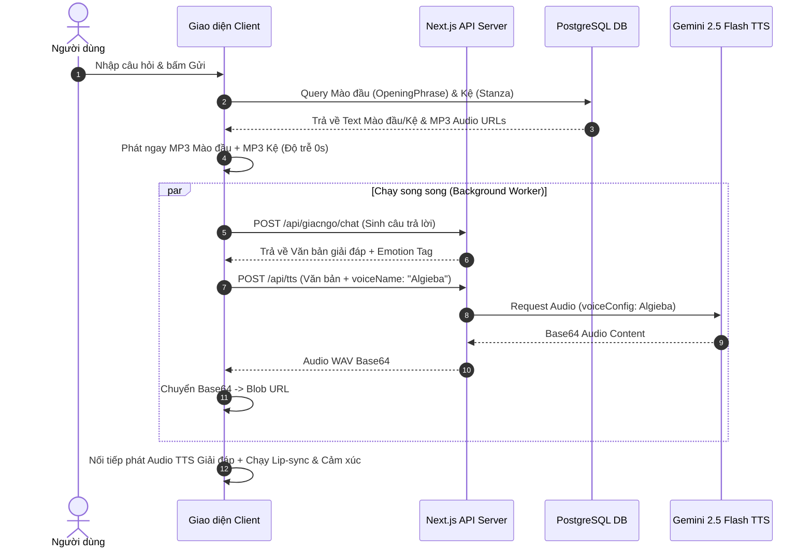

# 🛠 KĨ THUẬT XỬ LÝ LUỒNG ĐÀM THOẠI (TECHNICAL PIPELINE SPECIFICATION)

Tài liệu mô tả chi tiết kiến trúc kĩ thuật, quy trình xử lý dữ liệu và luồng âm thanh/hình ảnh khi hệ thống **Ông Lão** thực hiện 1 lượt **Đàm thoại (Conversation Step)**.

---

## 📌 1. KIẾN TRÚC TỔNG QUAN (TECHNICAL ARCHITECTURE)

Một lượt đàm thoại tiêu chuẩn gồm **3 thành phần âm thanh & văn bản** kết hợp nối tiếp nhau:

```text
┌────────────────────────┐      ┌────────────────────────┐      ┌────────────────────────┐
│  1. MÀO ĐẦU (GREETING) │  ──► │   2. KỆ PHÁP (STANZA)  │  ──► │  3. GIẢI ĐÁP (TTS AI)  │
│  Text + Pre-rendered   │      │  Text + Pre-rendered   │      │  Text AI + Gemini TTS  │
│  MP3 Audio (Có sẵn)    │      │  MP3 Audio (Có sẵn)    │      │  WAV Audio (Sinh ngầm) │
└────────────────────────┘      └────────────────────────┘      └────────────────────────┘
```

---

## ⚙️ 2. QUY TRÌNH THỰC THI CHI TIẾT 4 BƯỚC (4-STEP PIPELINE)

### BƯỚC 1: XỬ LÝ CÂU MÀO ĐẦU (OPENING PHRASE / GREETING)
1. **Phân loại Ngữ cảnh (Category Mapping)**:
   - Khi người dùng gửi tin nhắn, hệ thống NLP phân tích từ khóa để chọn nhóm mào đầu phù hợp:
     - `mundane_weather` (Thời tiết / Chuyện đời thường)
     - `serious_dharma` (Hỏi đạo nghiêm túc)
     - `love_heartbreak` (Tình cảm / Tổn thương)
     - `money_debt` (Tài chính / Nợ nần / Công danh)
2. **Trích xuất Dữ liệu Mào đầu**:
   - Truy vấn câu mào đầu từ DB PostgreSQL (`OpeningPhrase`):
     - `text`: Văn bản mào đầu (VD: *"A Di Đà Phật, lão chào con..."*).
     - `audioUrl`: Đường dẫn tệp âm thanh thu sẵn (VD: `/uploads/audio/greeting_mundane_weather_0.wav`).
3. **Phát Âm Thanh Mào Đầu**:
   - Hệ thống lập tức phát `audioUrl` mào đầu mà **KHÔNG CẦN CHỜ AI** sinh câu trả lời, giúp người dùng nghe giọng Lão ngay lập tức (độ trễ 0s).

---

### BƯỚC 2: TRÍCH XUẤT KỆ PHÁP / THƠ THIỀN (POEM STANZA & AUDIO)
1. **Truy vấn Kệ Pháp (RAG Knowledge Matching)**:
   - Tìm kiếm bài kệ pháp/khổ thơ liên quan nhất đến trăn trở của người dùng trong DB (`Poem` & `Stanza`).
2. **Trích xuất Dữ liệu Kệ**:
   - `text`: Nội dung khổ kệ thiền.
   - `audioUrl`: Đường dẫn âm thanh ngắt nhịp thơ thu sẵn (`stanza.audioUrl`).
3. **Nối Chuỗi Âm Thanh (Audio Queueing)**:
   - Thêm `stanza.audioUrl` vào danh sách chờ phát nối tiếp sau câu mào đầu.

---

### BƯỚC 3: AI GIẢI ĐÁP & SINH GIỌNG ĐỌC TTS (GEMINI AI & TTS SYNTHESIS)

Trong lúc 2 âm thanh mào đầu & kệ đang phát, hệ thống chạy **Worker ngầm (Background Prefetch)** để xử lý phần giải đáp:

1. **Sinh Văn Bản Giải Đáp (LLM Generation)**:
   - Gửi Prompt sang Gemini API kèm ngữ cảnh cuộc trò chuyện.
   - AI trả về văn bản kèm nhãn cảm xúc ở đầu dòng (VD: `[vui] An lạc vốn dĩ ở trong tâm con...`).
2. **Làm Sạch Văn Bản Cho TTS (`cleanTextForTTS`)**:
   - Loại bỏ các ký tự đặc biệt, nhãn tag `[vui]`, `[buon]`.
   - Ngắt câu bằng dấu chấm câu để TTS đọc rõ ràng.
3. **Gọi API Tổng Hợp Giọng Nói (Gemini 2.5 Flash TTS)**:
   - Gửi yêu cầu HTTP POST tới `/api/tts`:
     ```json
     {
       "text": "Giọng ấm áp, dứt khoát: An lạc vốn dĩ ở trong tâm con...",
       "voiceName": "Algieba",
       "model": "gemini-2.5-flash-preview-tts"
     }
     ```
   - Server gửi yêu cầu tới Google Gemini REST API (`generateContent` với `responseModalities: ["AUDIO"]`).
   - Server trả về dữ liệu âm thanh Base64 WAV.
4. **Tạo Blob URL**:
   - Client nhận Base64, chuyển thành `Blob` và `URL.createObjectURL(blob)` làm `audioUrl` cho phần giải đáp.

---

### BƯỚC 4: GHÉP NỐI ÂM THANH & ĐIỀU KHIỂN LIP-SYNC (AUDIO STITCHING & VISUAL DRIVER)

1. **Chuỗi Phát Nối Tiếp (Sequential Playback Queue)**:
   ```javascript
   // Luồng phát nối tiếp 3 đoạn âm thanh
   const playChain = async () => {
       await playAudio(greetingAudioUrl); // Đoạn 1: Mào đầu
       await playAudio(stanzaAudioUrl);   // Đoạn 2: Kệ pháp
       await playAudio(ttsAudioUrl);      // Đoạn 3: TTS Giải đáp
   };
   ```
2. **Đồng Bộ Nhịp Môi (Lip-Sync Driver)**:
   - Phân tích tần số âm thanh bằng `Web Audio API` (`AudioContext` & `AnalyserNode`).
   - Cập nhật biến `mouthOpen` (từ 0.0 đến 1.0) theo thời gian thực để điều khiển khẩu hình miệng của nhân vật trên canvas/CSS.
3. **Chuyển Cảnh & Cảm Xúc (State & Visual Transition)**:
   - Đổi góc máy và trạng thái cảm xúc nhân vật (`calm`, `sad`, `joy`) tương ứng với nhãn cảm xúc bóc tách từ câu thoại.

---

## 📊 3. SƠ ĐỒ LUỒNG DỮ LIỆU (MERMAID SEQUENCE DIAGRAM)



---

## 🗄️ 4. BẢNG DỮ LIỆU THAM CHIẾU (DATABASE SCHEMAS)

- **`OpeningPhrase`**: `id`, `text`, `audioUrl`, `category`, `tags`.
- **`Stanza`**: `id`, `poemId`, `content`, `meaning`, `audioUrl`.
- **`ChatSession`**: `id`, `laoVoice`, `laoVoiceStyle`, `userVoice`, `userVoiceStyle`.
- **`ChatMessage`**: `id`, `sessionId`, `role`, `content`, `emotion`, `audioUrl`.

---

*Tài liệu kĩ thuật được lưu trữ tại `docs/LUONG_XU_LY_KY_THUAT_DAM_THOAI.md`.*
